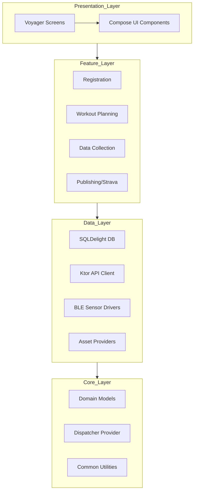
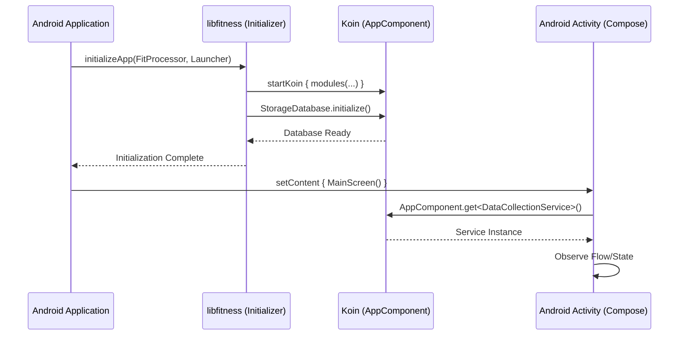

# Android Developer Integration Guide: libfitness

This guide explains how to integrate the `libfitness` Kotlin Multiplatform (KMP) library into your Android application.

## 0. Architecture Overview

To better understand how `libfitness` is structured and how it integrates with your Android application, refer to the following block diagrams.

### 0.1 Internal Module Architecture
This diagram illustrates the internal layering of the library. Each layer depends on the one below it.



### 0.2 Integration Flow
This diagram shows the lifecycle of the library from initialization in the Android app to active usage in the UI.



## 1. Project Setup & Dependency Configuration

### 1.1 Including the Library

There are two primary ways to include `libfitness` in your Android project during development:

#### Option A: Module Dependency (Recommended for Development)
If you have the `libfitness` source code in the same repository or as a git submodule, you can include it directly in your `settings.gradle.kts`:

```kotlin
include(":libfitness")
project(":libfitness").projectDir = file("../path-to-libfitness/libfitness")
```

Then, in your Android app's `build.gradle.kts`:

```kotlin
dependencies {
    implementation(project(":libfitness"))
}
```

#### Option B: Local Publication (Maven Local)
You can publish the library to your local Maven repository:

1. In the `libfitness` project, run:
   ```bash
   ./gradlew :libfitness:publishToMavenLocal
   ```
2. In your Android project's `settings.gradle.kts`, ensure `mavenLocal()` is included in the repositories:
   ```kotlin
   dependencyResolutionManagement {
       repositories {
           mavenLocal()
           google()
           mavenCentral()
       }
   }
   ```
3. In your app's `build.gradle.kts`, add the dependency:
   ```kotlin
   dependencies {
       implementation("com.skjline.fitness:libfitness:0.1.0-SNAPSHOT")
   }
   ```

### 1.2 Mandatory Gradle Plugins

To correctly support the shared UI and data layers, your Android application's `build.gradle.kts` (or the root `build.gradle.kts`) must include the following plugins:

```kotlin
plugins {
    id("com.android.application")
    kotlin("android")
    
    // Required for Compose Multiplatform UI
    alias(libs.plugins.jetbrainsCompose)
    alias(libs.plugins.compose.compiler)
    
    // Optional: Required if you use SQLDelight in the host app
    alias(libs.plugins.sqldelight)
    
    // Optional: Required for Kotlinx Serialization
    alias(libs.plugins.kotlinx.serialization)
}
```

> **Note:** Ensure the versions of these plugins match those used in `libfitness` to avoid binary compatibility issues.

### 1.3 Essential Dependencies

While `libfitness` bundles most of its dependencies, your Android app may need to explicitly declare some of them if you intend to interact with the shared logic or UI directly.

| Library | Purpose | Implementation (App `build.gradle.kts`) |
| :--- | :--- | :--- |
| **Koin** | Dependency Injection & Initialization | `implementation(libs.koin.android)` |
| **Compose** | Hosting shared UI in Activities | `implementation(libs.androidx.activity.compose)` |
| **SQLDelight** | Providing the Android SQL driver | `implementation(libs.sqldelight.android)` |
| **Ktor** | Configuring the OkHttp engine | `implementation(libs.ktor.okhttp)` |

> **Tip:** Using the same versions as `libfitness` (via a shared Version Catalog) is highly recommended to avoid `Duplicate class` errors or binary incompatibilities.

## 2. Library Initialization & DI Integration

### 2.1 Basic Initialization

To initialize `libfitness`, you should call `initializeApp` in your Android `Application` class. This bootstraps the shared Koin DI container and prepares the internal database.

You will need to provide:
1. A `FitProcessor` (for handling .fit file encoding/decoding).
2. A `Launcher` (for handling navigation).

```kotlin
class MyFitnessApp : Application() {
    override fun onCreate() {
        super.onCreate()

        initializeApp(
            processor = MyFitProcessor(), // Your implementation of FitProcessor
            launcher = DefaultLauncher(), // Or your implementation of Launcher
        ) {
            // Android-specific Koin configuration
            androidContext(this@MyFitnessApp)
            androidLogger()
        }
    }
}
```

### 2.2 Providing Android Context

Many parts of `libfitness` (especially the SQLDelight database and certain platform-specific features) require an Android `Context`. You **must** provide this context during initialization via the `block` parameter.

Failure to provide the context will result in a `Koin` exception when the database driver is created.

```kotlin
initializeApp(
    processor = MyFitProcessor(),
    launcher = DefaultLauncher(),
) {
    // CRITICAL: Provide the application context
    androidContext(this@MyFitnessApp)
    
    // Optional: Enable Koin logging for easier debugging
    androidLogger()
}
```

### 2.3 Resolving Dependencies with `AppComponent`

`libfitness` uses `AppComponent` as a central entry point to resolve shared dependencies. This is particularly useful when you need to access shared logic (like repositories or services) from native Android code (e.g., in a native ViewModel or a WorkManager task).

Because `AppComponent` implements `KoinComponent`, you can use it to fetch any instance registered in the Koin container.

```kotlin
// In your Android native code
val storage = AppComponent.get<StorageDatabase>()
val dispatcherProvider = AppComponent.get<DispatcherProvider>()
```

#### Common Dependencies to Resolve:
- **`StorageDatabase`**: The main entry point for data persistence.
- **`DispatcherProvider`**: Provides Coroutine dispatchers (IO, Main, Default) consistent with the library's threading model.
- **`Launcher`**: The shared navigator instance.
- **`FitProcessor`**: The file processor you provided during initialization.

> **Note:** Dependency resolution via `AppComponent` will only work **after** `initializeApp` has been called.

### 2.4 Key Interfaces

#### The `Launcher` Interface
The `Launcher` is responsible for navigating between screens.

```kotlin
interface Launcher {
    fun launch(route: Route)
}
```

#### The `FitProcessor` Interface
The `FitProcessor` handles file I/O for fitness data. You must provide an implementation suitable for Android (e.g., using `context.openFileOutput`).

```kotlin
interface FitProcessor {
    fun processFitFileData(filename: String, content: FitContent): FileCreateResult
    fun loadFitFile(filename: String): ByteArray
}
```

### 2.5 Implementation Examples

#### Custom `Launcher` Implementation
If you want to handle navigation using standard Android `Intent`s or a specific navigation library:

```kotlin
class AndroidLauncher(private val context: Context) : Launcher {
    override fun launch(route: Route) {
        when (route) {
            is Route.MainRoute -> {
                val intent = Intent(context, MainActivity::class.java)
                intent.addFlags(Intent.FLAG_ACTIVITY_NEW_TASK)
                context.startActivity(intent)
            }
            // Handle other routes...
        }
    }
}
```

#### Custom `FitProcessor` Implementation
A basic implementation that saves and loads `.fit` files from the app's internal storage:

```kotlin
class AndroidFitProcessor(private val context: Context) : FitProcessor {
    override fun processFitFileData(filename: String, content: FitContent): FileCreateResult {
        return try {
            val file = File(context.filesDir, filename)
            file.writeBytes(content.toByteArray())
            FileCreateResult.Success(file.absolutePath)
        } catch (e: Exception) {
            FileCreateResult.Failed(e.message ?: "Unknown error")
        }
    }

    override fun loadFitFile(filename: String): ByteArray {
        val file = File(context.filesDir, filename)
        return if (file.exists()) file.readBytes() else byteArrayOf()
    }
}
```

## 3. Shared UI Integration (Compose Multiplatform & Voyager)

`libfitness` uses **Compose Multiplatform** for its UI and **Voyager** for navigation. You can host shared screens directly within your Android `Activity`.

### 3.1 Hosting a Shared Screen

To show a shared screen in your Android Activity, use `ComponentActivity.setContent` and wrap the shared Composable.

```kotlin
class MainActivity : ComponentActivity() {
    override fun onCreate(savedInstanceState: Bundle?) {
        super.onCreate(savedInstanceState)
        
        setContent {
            // 1. Apply your app's theme (or the shared library's theme)
            FitnessTheme {
                // 2. Initialize the shared Navigator with a starting Screen
                Navigator(screen = ScreenWorkout()) { navigator ->
                    // 3. Apply shared transitions (optional)
                    SlideTransition(navigator)
                }
            }
        }
    }
}
```

#### Available Common Screens:
- `ScreenHome()`: The dashboard/home screen.
- `ScreenWorkout()`: The workout planning/selection screen.
- `ScreenProfile()`: User settings and profile.
- `SessionActivityScreen(path: String)`: The active tracking/telemetry screen.

### 3.2 Requirements for `setContent`

When hosting shared components in your Android Activity, ensure the following requirements are met within the `setContent` block:

#### 1. Theme Application
While many shared screens (like `MainScreen`) wrap themselves in a `MaterialTheme`, it is best practice to provide a consistent theme at the root of your Activity. This ensures that any system-level UI (like Dialogs or Scaffolds) uses your app's branding.

```kotlin
setContent {
    MaterialTheme { // Or your custom MyComposeTheme { ... }
        MainScreen()
    }
}
```

#### 2. Koin Context (Compose)
If you intend to use Koin-specific Compose features (like `koinViewModel()` or `getKoin()`) within your native code that interops with the library, you should wrap your UI in `KoinContext`.

```kotlin
setContent {
    KoinContext { // Provides the Koin instance to the Compose tree
        FitnessTheme {
            Navigator(ScreenWorkout())
        }
    }
}
```

#### 3. Handling Insets
Shared screens often use `Scaffold` or `Modifier.windowInsetsPadding`. To ensure the UI respects the status bar and navigation bar, your Activity should call `enableEdgeToEdge()` before `setContent`.

```kotlin
override fun onCreate(savedInstanceState: Bundle?) {
    super.onCreate(savedInstanceState)
    enableEdgeToEdge()
    setContent { 
        MainScreen()
    }
}
```

### 3.3 Handling Multi-platform Resources (Images, Strings)

`libfitness` uses the **Compose Multiplatform Resources** library (`org.jetbrains.compose.resources`). This allows images, strings, and other assets to be shared across platforms.

#### Accessing Shared Resources in Android
When the library is integrated, it generates a `Res` object (usually under the library's package) that you can use in your native Compose code.

```kotlin
import com.skjline.fitness.resources.Res
import com.skjline.fitness.resources.ic_bike
import org.jetbrains.compose.resources.vectorResource
import org.jetbrains.compose.resources.stringResource

@Composable
fun NativeAndroidView() {
    // Accessing a shared vector image
    val bikeIcon = vectorResource(Res.drawable.ic_bike)
    
    // Accessing a shared string (if defined in commonMain)
    // val appName = stringResource(Res.string.app_name)
    
    Icon(imageVector = bikeIcon, contentDescription = null)
}
```

#### Important Configuration
To ensure the host Android app can correctly link and use these shared resources, ensure your app's `build.gradle.kts` has the `jetbrainsCompose` plugin applied:

```kotlin
plugins {
    alias(libs.plugins.jetbrainsCompose)
}
```

> **Note:** Shared resources are stored in `commonMain/composeResources`. During the Android build process, these are automatically merged into the final APK's assets/resources.

### 3.4 Handling Navigation (The `Launcher` Connection)

When a shared screen triggers a navigation event (e.g., clicking "Start Workout"), it uses the `Launcher` implementation you provided during `initializeApp`.

If you use `DefaultLauncher`, it will attempt to navigate within the shared `Navigator`. If you want to handle certain routes natively (e.g., opening a native Android Activity for Strava login), you should implement your own `Launcher`.

```kotlin
class MyLauncher(private val navigator: Navigator) : Launcher {
    override fun launch(route: Route) {
        when (route) {
            is Route.SessionRoute -> navigator.push(SessionActivityScreen(route.path))
            is Route.MainRoute -> navigator.push(ScreenHome())
            // Handle native-only routes
            is RegistrationRoute -> {
                // Launch native Android Activity
            }
            else -> { /* handle others */ }
        }
    }
}
```

> **Note:** You can update the `Launcher` instance in the Koin container if you need to pass a reference to the `Navigator` created in your Activity.

## 4. Business Logic Consumption (Repositories & Services)

For custom UI implementations, you can access the shared business logic directly via `AppComponent`.

### 4.1 Key Services & Repositories

#### `StorageDatabase` (Persistence)
Used for managing user profiles and local app state.

```kotlin
val db = AppComponent.get<StorageDatabase>()

// Get a user profile property
val profile = db.getUserProfile("user_name")

// Update a property
db.insertOrUpdateUserProfile("user_name", "John Doe")
```

#### `BluetoothSearchService` (BLE Scanning)
Used to discover and connect to fitness sensors (HRM, Trainers).

```kotlin
val bleService = AppComponent.get<BluetoothSearchService>()

// Observe the scan state
lifecycleScope.launch {
    bleService.scanDeviceState.collect { operation ->
        when (operation) {
            is OnDeviceUpdated -> {
                val devices = operation.devices
                // Update your native UI list
            }
            is ScanError -> { /* Handle error */ }
        }
    }
}

// Start scanning
bleService.startScanning()
```

#### `DataCollectionService` (Workout Sessions)
The core engine for active workout sessions and telemetry.

```kotlin
val collector = AppComponent.get<DataCollectionService>()

// Start a session with a training course
collector.beginSession(myMrcCourse)

// Observe real-time data packets (Power, Cadence, HR)
lifecycleScope.launch {
    collector.collect().collect { packet ->
        when (packet.type) {
            PacketType.Power -> { /* update power UI */ }
            PacketType.HeartRate -> { /* update HR UI */ }
        }
    }
}
```

### 4.2 Patterns for Observing Shared State

When consuming shared `Flow`s or `StateFlow`s in your native Android code, follow standard lifecycle-aware collection patterns to avoid memory leaks.

```kotlin
class MyNativeViewModel : ViewModel() {
    private val bleService = AppComponent.get<BluetoothSearchService>()
    
    val deviceList: StateFlow<List<BluetoothComponent>> = bleService.scanDeviceState
        .map { if (it is OnDeviceUpdated) it.devices else emptyList() }
        .stateIn(viewModelScope, SharingStarted.WhileSubscribed(5000), emptyList())
}
```

In your Activity/Fragment:

```kotlin
lifecycleScope.launch {
    repeatOnLifecycle(Lifecycle.State.STARTED) {
        viewModel.deviceList.collect { devices ->
            // Update UI
        }
    }
}
```

## 5. Summary & Best Practices

- **Initialize Early:** Always call `initializeApp` in your `Application.onCreate()`.
- **Provide Context:** Never forget `androidContext(this)` in the initialization block.
- **Use AppComponent:** It's the cleanest way to bridge shared logic into native Android components.
- **Lifecycle Awareness:** Use `repeatOnLifecycle` or `flowWithLifecycle` when observing shared flows in native code.
- **Theme Consistency:** Wrap shared screens in your app's theme to maintain a unified look and feel.
